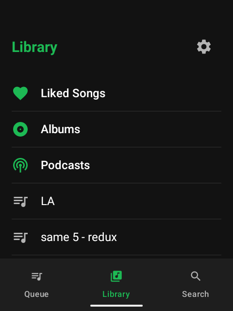
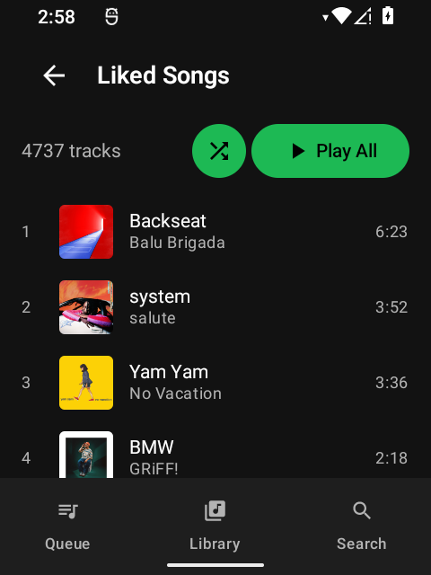
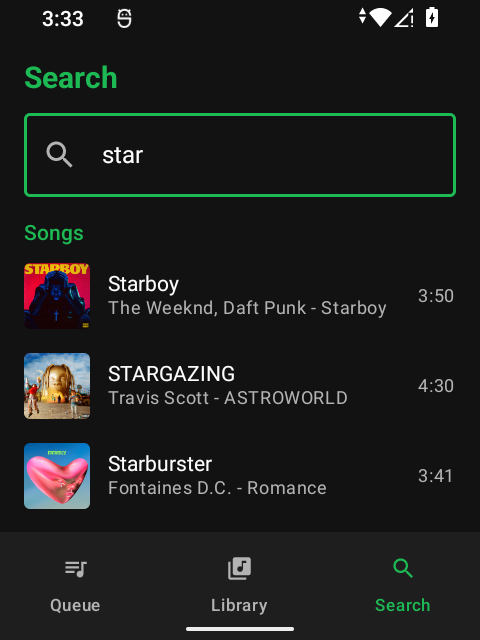
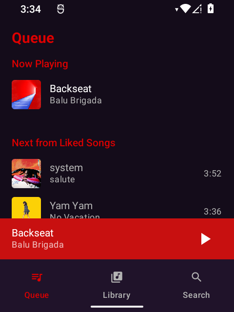

# sidespot

A lightweight, GMS-free Spotify client for the [Sidephone SP-01](https://sidephone.com) and similar small-screen Android devices.

Built on [librespot](https://github.com/librespot-org/librespot) (Rust) with a minimal [Jetpack Compose](https://developer.android.com/jetpack/compose) UI optimized for 480x640 displays.

## Screenshots

<p align="center">
  
  
  
  
  
</p>

## Features

- **No Google Play Services required** -- runs on degoogled and minimal Android devices
- **Optimized for small screens** -- dark theme, 48dp+ touch targets, designed for 2.8" displays
- **Full playback** -- play, pause, seek, skip, shuffle, repeat, queue management
- **Library browsing** -- playlists, liked songs, saved albums
- **Search** -- find tracks, albums, and podcasts
- **Background playback** -- foreground service with media notification controls
- **Hardware volume keys** -- physical button integration
- **Audio focus** -- pauses for calls, ducks for notifications, resumes automatically
- **Settings** -- audio quality (96/160/320 kbps), volume normalization, gapless playback, autoplay

## Requirements

- Spotify Premium account
- Android 12+ (API 31+), arm64 device

## Install

### From Releases

Download the latest APK from [Releases](https://codeberg.org/jtaekman/sidespot/releases) and sideload it onto your device:

```sh
adb install sidespot-v*.apk
```

### From Obtainium

To track updates automatically via [Obtainium](https://github.com/ImranR98/Obtainium):

1. Open Obtainium
2. Add app -> enter the repository URL: `https://codeberg.org/jtaekman/sidespot`
3. Obtainium will check for new releases and notify you when updates are available

## Build from Source

### Prerequisites

- **Java 17** (e.g. `brew install openjdk@17`)
- **Android SDK** (API 34) with NDK `27.0.12077973`
- **Rust toolchain** with the `aarch64-linux-android` target
- **[cargo-ndk](https://github.com/nicegram/aspect-cargo-ndk)** (`cargo install cargo-ndk`)

### Setup

```sh
# Install Rust Android target
rustup target add aarch64-linux-android

# Clone with submodules (librespot)
git clone --recurse-submodules https://codeberg.org/jtaekman/sidespot.git
cd sidespot
```

### Build & Install

The Gradle build automatically compiles the Rust native library via `cargo-ndk` before assembling the APK.

```sh
# Debug build + install to connected device
export JAVA_HOME=$(brew --prefix openjdk@17)/libexec/openjdk.jdk/Contents/Home
./gradlew installDebug

# Release APK (requires signing config in release-keystore.properties)
./gradlew assembleRelease
```

The release APK will be at `app/build/outputs/apk/release/app-release.apk`.

### Release Signing

To build a signed release APK, create `release-keystore.properties` in the project root:

```properties
storeFile=path/to/your/keystore.jks
storePassword=your-store-password
keyAlias=your-key-alias
keyPassword=your-key-password
```

## Architecture

```
┌─────────────────────────────┐
│   Jetpack Compose UI        │  Kotlin / MVVM
│   (Library, Search, Player) │
├─────────────────────────────┤
│   JNI Bridge                │  Kotlin external fun <-> Rust extern "C"
├─────────────────────────────┤
│   librespot (Rust)          │  Session, playback, metadata, audio decoding
│   + Tokio async runtime     │
└─────────────────────────────┘
```

- **Native core**: librespot handles Spotify protocol, authentication, audio streaming, and decryption
- **JNI bridge**: Serializes data as JSON between Kotlin and Rust
- **Audio pipeline**: librespot decodes OGG Vorbis to PCM, delivers samples via JNI callback to Android AudioTrack
- **UI**: Jetpack Compose with Navigation, Material3, Coil for album art

## Sidephone Only Features

When a Sundial keypad is connected, sidespot enables full hardware navigation -- no touchscreen needed.

| Control | Action |
|---------|--------|
| **Dial up / down** | Scroll lists; adjust volume on Now Playing |
| **Dial left** | Previous track |
| **Dial right** | Next track |
| **Center glass** | Select focused item in lists; Play/Pause on Now Playing |
| **Top-left (←)** | Navigate back |
| **Top-right (→)** | (pass-through) |
| **Bottom-left (Tab)** | Show / hide Now Playing |
| **Bottom-right (Enter)** | Select focused item |

Additional adaptations when a Sundial is detected:
- **Focus indicators** on all list items (highlighted border)
- **Stacked Play All / Shuffle buttons** in playlist and album views for easy D-pad access
- **Auto-focus on Play All** when entering a playlist or album

## Current Limitations

- **Spotify Premium required** -- free-tier accounts are not supported by librespot
- **arm64 only** -- the native library is built exclusively for `arm64-v8a` (aarch64)
- **No lossless/HiFi** -- max quality is 320 kbps OGG Vorbis. Spotify's lossless tier uses DRM that librespot cannot and will not circumvent
- **No Spotify Connect** -- the device does not appear as a Spotify Connect target
- **No crossfade** -- crossfade between tracks is not supported
- **No offline mode** -- streaming only, no download/cache for offline listening
- **Account risk** -- Spotify has not sanctioned third-party clients. Use at your own risk

## Disclaimer

sidespot is not affiliated with or endorsed by Spotify. It uses a reverse-engineered protocol implementation ([librespot](https://github.com/librespot-org/librespot)). Use at your own risk. A Spotify Premium subscription is required.

## License

GPLv3. See [LICENSE](LICENSE) for details.
